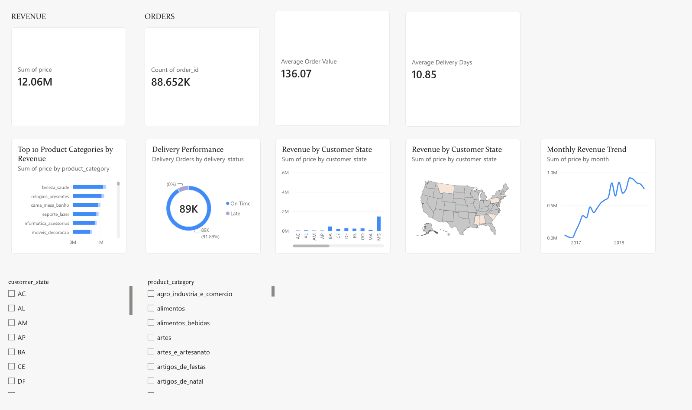

# End-to-End E-Commerce ETL Data Engineering Pipeline

An end-to-end data engineering project that extracts, transforms, validates, and loads Brazilian e-commerce data into MySQL, performs analytical SQL queries, orchestrates the pipeline using Apache Airflow, and visualizes business insights using Power BI.

## 📌 Project Overview

This project demonstrates a complete ETL workflow using the Olist Brazilian E-Commerce dataset.

The pipeline processes raw e-commerce data through multiple stages:

Raw Data → Extraction → Transformation → Validation → MySQL → SQL Analytics → Power BI

Apache Airflow is used to orchestrate and automate the ETL workflow.

## 🎯 Business Objectives

The pipeline is designed to answer questions such as:

- How much revenue is generated over time?
- Which product categories generate the most revenue?
- How many orders are delivered?
- What is the average order value?
- How long does delivery take?
- Which customer states generate the most revenue?
- What percentage of orders are delivered on time?

## 🏗️ Architecture

```text
Olist E-Commerce Dataset
          ↓
     Python Extract
          ↓
      Raw CSV Data
          ↓
   Pandas Transformation
          ↓
     Data Validation
          ↓
       MySQL DB
          ↓
     SQL Analytics
          ↓
    Power BI Dashboard
          
Apache Airflow
      ↓
Orchestrates the ETL workflow

🛠️ Tech Stack
Python
Pandas
MySQL
SQL
Apache Airflow
Power BI
Git & GitHub
VS Code

📂 Project Structure
ecommerce-etl-pipeline/
│
├── data/
│   ├── raw/
│   ├── processed/
│   └── sample/
│
├── dags/
│   └── olist_etl_dag.py
│
├── src/
│   ├── extract.py
│   ├── inspect_orders.py
│   ├── transform.py
│   ├── validate.py
│   ├── load.py
│   └── export_dashboard.py
│
├── sql/
│   └── analytics.sql
│
├── notebooks/
├── tests/
├── logs/
│
├── .gitignore
├── requirements.txt
└── README.md

🔄 ETL Pipeline
1. Extract
src/extract.py
Reads raw CSV files
Detects available datasets dynamically
Handles extraction errors
Generates execution logs
2. Transform
src/transform.py
Standardizes column names
Handles missing values
Removes duplicates
Converts timestamps
Creates derived date and delivery fields
Produces cleaned datasets
3. Validate
src/validate.py
Performs data quality checks including:
Record count validation
Null primary-key checks
Duplicate checks
Valid order-status checks
Negative delivery-time checks
4. Load
src/load.py
Loads processed data into MySQL relational tables with:
Primary keys
Foreign keys
Referential integrity
Duplicate protection
NULL handling
5. SQL Analytics
sql/analytics.sql
Includes analytical queries using:
JOINs
CASE statements
Subqueries
CTEs
Window functions
Aggregations
6. Airflow
The Airflow DAG:
Extract
   ↓
Transform
   ↓
Validate
   ↓
Load
The pipeline includes retries, scheduling, and task dependencies.
7. Power BI
The dashboard contains:
Total Revenue
Delivered Orders
Average Order Value
Average Delivery Days
Monthly Revenue Trend
Top 10 Product Categories
Delivery Performance
Revenue by Customer State
Interactive filters

📊 Dashboard
Add your Power BI dashboard screenshot here:

🗄️ Database Design
Main tables:
dim_customer
dim_product
dim_seller
fact_orders
fact_order_items
fact_payments
fact_reviews
The schema uses fact and dimension tables to support analytical queries.
▶️ How to Run
Clone the repository
git clone https://github.com/Lahari2005/ecommerce-etl-pipeline.git
cd ecommerce-etl-pipeline
Create virtual environment
python3 -m venv .venv
source .venv/bin/activate
Install dependencies
pip install -r requirements.txt
Configure environment variables
Create a .env file:
MYSQL_HOST=localhost
MYSQL_USER=root
MYSQL_PASSWORD=your_password
MYSQL_DATABASE=olist_analytics
Never commit .env to GitHub.
Run ETL manually
python src/extract.py
python src/transform.py
python src/validate.py
python src/load.py
Run SQL analytics
mysql -u root -p olist_analytics < sql/analytics.sql
📚 Dataset
This project uses the Brazilian E-Commerce Public Dataset by Olist.
Dataset source:
Olist Brazilian E-Commerce Public Dataset — Kaggle
The dataset is used for educational and portfolio purposes.
🚀 Future Improvements
Add automated ingestion of newly arriving data
Improve database loading performance with batch inserts
Add more automated data-quality tests
Containerize the pipeline with Docker
Deploy the pipeline to a cloud platform
Add CI/CD using GitHub Actions

👩‍💻 Author
Lahari Varma
